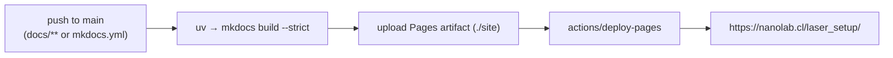

# Building & deploying these docs

This documentation site is built with [MkDocs](https://www.mkdocs.org/) +
[Material for MkDocs](https://squidfunk.github.io/mkdocs-material/). All of its
source lives in the **`docs/`** subfolder; the configuration is `mkdocs.yml` at
the repository root. You can build it with **`uv`** or **Docker** — nothing is
installed system-wide either way.

## Layout

```text
laser_setup/
├── mkdocs.yml                 # site config + navigation
└── docs/                      # ← all documentation source lives here
    ├── index.md
    ├── getting-started/  tutorials/  user-guide/
    ├── developer-guide/  reference/  protocols/
    ├── led_protocol.md  led_calibration.md  "Short protocol.md"
    ├── docker-compose.yml     # one-command Docker preview
    └── assets/                # JS (MathJax) and any images
```

The MkDocs tooling is declared as an **isolated `uv` dependency group** named
`docs` in `pyproject.toml`, so it never mixes with the application's runtime
dependencies.

## Preview locally with `uv`

```bash
uv run --group docs mkdocs serve
```

Open <http://127.0.0.1:8000>. The site live-reloads as you edit files in
`docs/`.

## Build a static site with `uv`

```bash
uv run --group docs mkdocs build --strict
```

The rendered site is written to `./site/` (git-ignored). `--strict` turns
warnings — like a broken internal link — into errors, which is exactly what CI
uses.

## Preview / build with Docker

If you'd rather not install `uv`, use the official Material image. From the
repository root:

```bash
# live preview at http://localhost:8000
docker compose -f docs/docker-compose.yml up

# one-shot static build into ./site
docker run --rm -v "$PWD":/docs squidfunk/mkdocs-material:9 build --strict
```

The compose file mounts the repository into the container so edits reload live.

## Deploying to GitHub Pages (automatic)

A GitHub Actions workflow, [`.github/workflows/docs.yml`](https://github.com/nanolab-fcfm/laser_setup/blob/main/.github/workflows/docs.yml),
builds and publishes the site on every push to `main` that touches the docs.



### One-time repository setup

1. In **Settings → Pages**, set **Source** to **GitHub Actions**.
2. Push to `main` (or run the workflow manually via **Actions → Deploy
   documentation → Run workflow**).

The workflow uses `uv` to install only the `docs` group, builds with
`--strict`, and deploys the `site/` artifact. No `gh-pages` branch is needed —
deployment uses the modern Pages artifact flow.

### Publishing under a different URL

If you fork the project or use a custom domain, update `site_url` (and
`repo_url`) in `mkdocs.yml`. For a project site the URL is
`https://<org>.github.io/<repo>/`.

## Manual deploy (alternative)

You can also publish straight from your machine to a `gh-pages` branch:

```bash
uv run --group docs mkdocs gh-deploy --force
```

This builds the site and pushes it to the `gh-pages` branch. Prefer the Actions
workflow for team projects so deploys are reproducible and reviewable.
