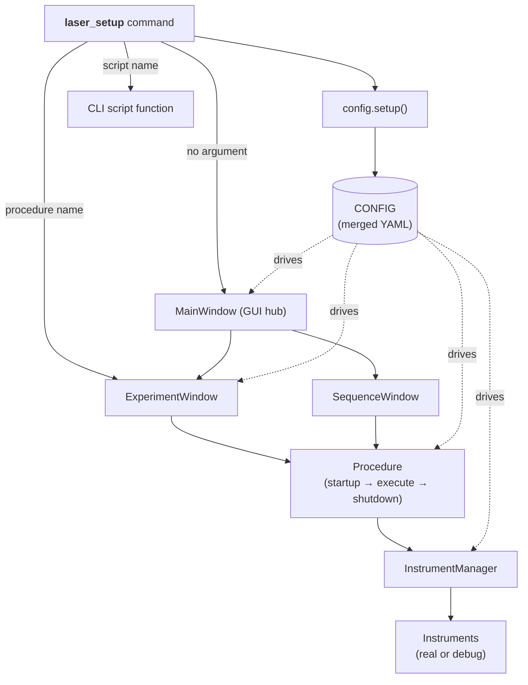

# Laser Setup

**Laser Setup** is an experimental control system for **laser**, **I–V**, and
**transfer-curve** measurements on nano-electronic devices. It is built on top of
[PyMeasure](https://pymeasure.readthedocs.io/en/latest/) and extends it with a
YAML-based configuration system (powered by [OmegaConf](https://omegaconf.readthedocs.io/)
and [Hydra](https://hydra.cc/)) so that instruments, measurement procedures and
sequences can be defined and modified **without touching Python code**.

-   :material-rocket-launch: **New here?**

    Install the project and launch the app for the first time.

    [:octicons-arrow-right-24: Getting Started](getting-started/index.md)

-   :material-school: **Learn by doing**

    Run real (simulated) experiments step by step — no hardware required.

    [:octicons-arrow-right-24: Tutorials](tutorials/index.md)

-   :material-book-open-variant: **Understand the system**

    How the GUI, configuration, procedures and instruments fit together.

    [:octicons-arrow-right-24: User Guide](user-guide/index.md)

-   :material-tools: **Build something new**

    Write your own measurement procedure or add a new instrument.

    [:octicons-arrow-right-24: Developer Guide](developer-guide/index.md)

## What can it do?

- **Control instruments** from your computer — source-meters, power supplies,
  light sources, power meters and temperature sensors.
- **Run measurement procedures** through a graphical interface with live plots,
  logs and parameter inputs.
- **Chain procedures into sequences** that run automatically, one after another.
- **Reproduce experiments** thanks to parameters and metadata saved alongside
  every data file.
- **Develop without hardware** using a built-in debug mode and a `FakeProcedure`
  that generates synthetic data — perfect for learning the software.

## Supported instruments

| Instrument | Role | Notes |
| --- | --- | --- |
| Keithley 2450 SourceMeter | Source/measure voltage & current | Requires [NI-VISA](https://www.ni.com/en-us/support/downloads/drivers/download.ni-visa.html) |
| Keithley 6517B Electrometer | High-impedance current measurement | Requires NI-VISA |
| TENMA Power Supply | Gate / laser bias | Serial (COM) connection |
| Thorlabs PM100D / PM100USB | Optical power measurement | Requires NI-VISA |
| Bentham TLS120Xe | Tunable light source (monochromator) | Proprietary `bendev` driver |
| PT100 / Clicker (RosaTech) | Temperature sense & hot-plate control | Custom serial firmware |

Any instrument from the
[PyMeasure instrument library](https://pymeasure.readthedocs.io/en/latest/api/instruments/index.html)
can also be used.

!!! tip "Read the PyMeasure docs too"
    Laser Setup builds directly on PyMeasure's `Procedure`, `Parameter`,
    `Results` and managed-window classes. Skimming the
    [PyMeasure documentation](https://pymeasure.readthedocs.io/en/latest/) will
    make everything here click into place much faster.

## How the pieces fit together

Read the [Architecture](user-guide/architecture.md) page for the full story.

## Where to go next

- **Just want to install it?** → [Installation](getting-started/installation.md)
- **Want a guided tour?** → [Tutorial 1: Your first experiment](tutorials/01-first-experiment.md)
- **Need to add a measurement?** → [Creating a New Procedure](developer-guide/creating-a-procedure.md)
- **Looking for a specific config key?** → [Configuration reference](reference/configuration.md)

---

!!! note "Conventions used in this documentation"
    - Shell commands are shown with a `$` prompt; type only what follows it.
    - Every Python/CLI command uses **`uv`** so that nothing is installed
      system-wide. See [Installation](getting-started/installation.md) for why.
    - File paths are given relative to the repository root unless stated
      otherwise.
