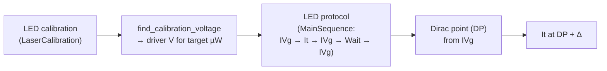

# Lab Protocols

These are the **bench protocols** the lab follows — the human side of the
measurements that the software automates. They are reproduced here as originally
written (Spanish/English) so they live alongside the code that implements them.

| Protocol | Implemented by | Summary |
| --- | --- | --- |
| [LED measurement protocol](../led_protocol.md) | `IVg`, `It`, `Wait` (≈ `MainSequence`) | Dark/illuminated transfer curves around the Dirac point, with timed LED exposure and recovery. |
| [LED power calibration](../led_calibration.md) | `LaserCalibration`, `find_calibration_voltage` | Map LED driver voltage → optical power per wavelength using the Thorlabs power meter. |
| [Short protocol](../Short protocol.md) | `IVg`, `It` (power & gate sweeps) | Condensed multi-wavelength transfer-curve + photocurrent workflow. |

## How the protocols map to the software

- **Calibrate first.** `LaserCalibration` sweeps the laser/LED driver voltage and
  records optical power. `find_calibration_voltage` then interpolates the voltage
  needed for a target power (e.g. 7.5 µW).
- **Measure around the Dirac point.** `IVg` finds the device's Dirac point
  (`DP`); subsequent `It` runs use gate voltages expressed as `DP + Δ V`.
- **Automate the flow.** The `MainSequence` sequence chains the LED-protocol
  steps so a full run happens unattended.

!!! tip "Running these as sequences"
    See [Sequences](../user-guide/sequences.md) and
    [Tutorial 3](../tutorials/03-sequences.md). The bundled `MainSequence`
    encodes the LED protocol's *IVg → It → IVg → Wait → IVg* flow.

## The protocols

- **[LED measurement protocol](../led_protocol.md)** — timing, gate biases
  relative to the Dirac point, and dark-recovery steps.
- **[LED power calibration](../led_calibration.md)** — power-meter setup and
  per-wavelength voltage calibration, with darkroom precautions.
- **[Short protocol](../Short protocol.md)** — a condensed end-to-end recipe for
  several wavelengths and gate/power sweeps.
