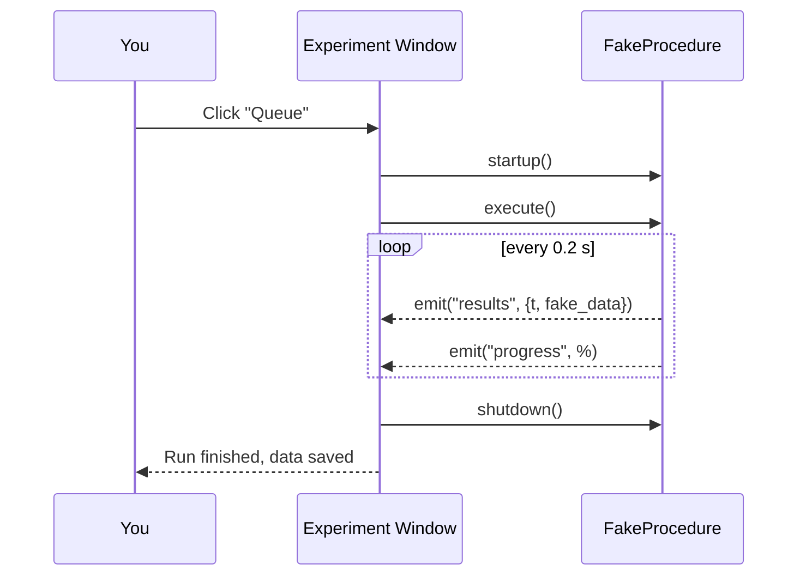

# Tutorial 1 · Your first experiment

**Goal:** run a complete measurement from start to finish and find the data it
produced. **Time:** ~5 minutes. **Hardware:** none.

!!! abstract "What you'll learn"
    - How to open an experiment window.
    - What *queueing* a run means.
    - Where your data is saved and what's inside it.

## Step 1 — Open the demo procedure

From the repository folder, run:

```bash
uv run laser_setup FakeProcedure
```

An **Experiment Window** appears. `FakeProcedure` is a built-in procedure that
fabricates data, so it needs no instruments. The window has three main areas:

- **Inputs** (left): the parameters for this run.
- **Plot** (center): a live graph that fills in as data arrives.
- **Browser / log** (bottom): the queue of runs and a live log.

## Step 2 — Look at the inputs

You'll see at least two inputs:

| Input | Meaning |
| --- | --- |
| **Total time** | How long (seconds) the fake measurement runs. Default `10`. |
| **Information** | A free-text note saved into the data file. |

Set **Total time** to `5` so the demo finishes quickly.

!!! note "Where do these inputs come from?"
    They are declared on the procedure class as PyMeasure *parameters* and
    listed in its `INPUTS`. You'll learn to define your own in
    [Tutorial 2](02-experiment-window.md) and the
    [Developer Guide](../developer-guide/parameters.md).

## Step 3 — Queue the run

Click **Queue**. This:

1. Creates a results file with a unique name.
2. Starts the procedure's lifecycle: `startup() → execute() → shutdown()`.
3. Streams results to the plot and progress bar in real time.

You should see the curve grow for ~5 seconds and the progress bar reach 100%.



## Step 4 — Find your data

The run wrote a CSV file under the **data directory** (default `./data`),
inside a dated subfolder:

```text
data/2026-06-21/FakeProcedure2026-06-21_1.csv
```

Open it in any text editor. Notice two parts:

```text
#Procedure: <laser_setup.procedures.FakeProcedure.FakeProcedure>
#Parameters:
#	Total time: 5.0 s
#	Information: None
#       ...
#Data:
t (s),fake_data
0.0,1.234
0.2,1.501
...
```

- The **header** records the procedure and *every parameter value* — so the
  measurement is fully reproducible.
- The **data** rows match the procedure's `DATA_COLUMNS` (`t (s)`, `fake_data`).

!!! success "Checkpoint"
    You just ran a full experiment: inputs → live plot → saved, self-describing
    data file. Every real measurement in Laser Setup works exactly this way.

## Step 5 — Try debug mode on a real procedure

`FakeProcedure` needs no instruments, but the *real* procedures do. To run one
without hardware, use **debug mode** (`-d`):

```bash
uv run laser_setup -d It
```

`It` (current vs. time) normally drives a Keithley source-meter, TENMA supplies
and sensors. In debug mode those are simulated, so you can press **Queue** and
watch it behave just like the real thing — with random data.

## Recap

- `uv run laser_setup <Procedure>` opens an experiment window for that procedure.
- **Queue** runs it; the plot and log update live.
- Data is saved as a self-describing CSV under `./data/<date>/`.
- `-d` lets *any* procedure run without hardware.

Next, let's dig into everything the experiment window can do →
[Tutorial 2: The Experiment Window](02-experiment-window.md).
