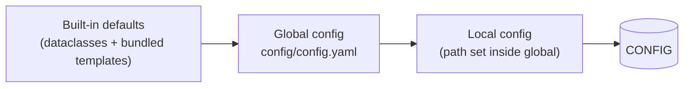

# Tutorial 4 · Your own configuration

**Goal:** create editable configuration files and change a default *the right
way*, without breaking the app. **Time:** ~10 minutes. **Hardware:** none.

!!! abstract "What you'll learn"
    - The difference between *defaults*, *global* and *local* config.
    - How to initialize and populate your `config/` folder correctly.
    - How to change a parameter default and reload.

## How configuration layers work

When the app starts it builds one merged `CONFIG` object from up to three layers,
each overriding the previous:



On a fresh clone, **only the defaults exist**, so the app runs with the bundled
templates. Creating `config/config.yaml` lets you override anything.

## Step 1 — Initialize your config

```bash
uv run laser_setup init
```

This creates:

```text
config/
├── config.yaml      # your global config (minimal to start)
└── templates/       # pristine copies you can crib from
```

## Step 2 — Populate the referenced files ⚠️

Open `config/config.yaml`. You'll see it points at sibling files:

```yaml
Dir:
  local_config_file: ./config/config.yaml
  procedures_file: ./config/procedures.yaml
  sequences_file: ./config/sequences.yaml
  instruments_file: ./config/instruments.yaml
```

Those `procedures.yaml` / `sequences.yaml` / `instruments.yaml` files **don't
exist yet** — they're sitting in `config/templates/`. Copy in the ones you want
to use:

=== "macOS / Linux"

    ```bash
    cp config/templates/{procedures,sequences,instruments,parameters}.yaml config/
    ```

=== "Windows (PowerShell)"

    ```powershell
    Copy-Item config\templates\*.yaml config\ -Exclude config.yaml
    ```

!!! danger "If you skip this step"
    With the files missing, the Procedures and Sequences menus will be
    **empty**. This is the single most common "why is my menu blank?" issue.
    Always copy the templates you reference.

Confirm everything is recognized again:

```bash
uv run laser_setup --help
```

You should see `It`, `IVg`, `FakeProcedure`, … listed.

## Step 3 — Change a parameter default

Let's make the demo procedure default to a longer run. Open
`config/procedures.yaml` and add (or edit) a `FakeProcedure` block. Parameter
overrides live under a `parameters:` key, matching the procedure's class name:

```yaml
FakeProcedure:
  parameters:
    total_time:
      value: 30.        # was 10 seconds by default
```

Save the file, then relaunch:

```bash
uv run laser_setup FakeProcedure
```

The **Total time** input now defaults to `30`. You changed application behavior
without editing any Python.

!!! info "What you can override"
    Under a procedure's `parameters:` you can set `value`, `units`, `minimum`,
    `maximum`, `group_by`, `choices`, etc. — anything on a PyMeasure parameter.
    You can also set non-parameter class attributes (like `procedure_version`).
    See [Defining Parameters](../developer-guide/parameters.md) and the
    [Configuration reference](../reference/configuration.md).

## Step 4 — Edit config from inside the app

You don't have to use a text editor. Launch the app and open **Config → Edit**.
This shows a live editor of `CONFIG`. After saving, click the red **Reload**
button (or ++ctrl+r++) so the app re-reads the files.

## Step 5 — Global vs. local config (optional)

For shared setups it's common to keep a **global** config in version control and
a **local** config for machine-specific tweaks (COM ports, data directory). The
global file's `Dir.local_config_file` points at the local one, and the local
layer wins. You can switch local configs at runtime via **Config → Import**.

## Recap

- Config = defaults → global → local, merged with later layers winning.
- `init` scaffolds `config/`, but you must **copy the template files you
  reference** into `config/`.
- Override parameter defaults under `<ProcedureName>: parameters:` — no code
  needed.
- Edit and reload from within the app via the Config menu.

Next: take it to the bench — mapping and detecting **real instruments** →
[Tutorial 5: Connecting real instruments](05-real-instruments.md).
