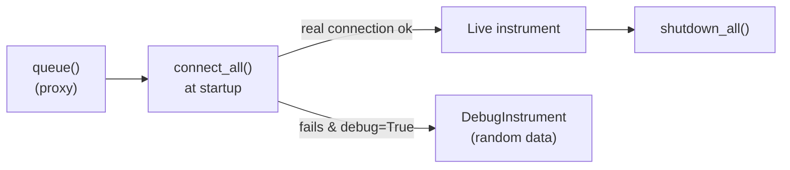

# Tutorial 5 · Connecting real instruments

**Goal:** understand how procedures find instruments, map them to your ports,
and move a measurement from *debug* to *real hardware*. **Time:** ~15 minutes.
**Hardware:** optional — you can follow along in debug mode.

!!! abstract "What you'll learn"
    - How instruments are declared in `instruments.yaml`.
    - How to auto-detect adapters with `setup_adapters`.
    - The lifecycle from "queued" proxy to live instrument, and back to debug.

!!! warning "Safety first"
    Real source-meters and supplies can damage devices. Double-check ranges,
    compliance currents and gate voltages before energizing anything. When in
    doubt, prototype in debug mode (`-d`).

## How a procedure gets its instruments

A procedure declares the instruments it needs as class attributes, each
*queued* from the `Instruments` config:

```python
class It(VgMixin, LaserMixin, ChipProcedure):
    instruments = InstrumentManager()
    meter:    Keithley2450 = instruments.queue(**Instruments.Keithley2450)
    tenma_neg: TENMA        = instruments.queue(**Instruments.TENMANEG)
    tenma_laser: TENMA      = instruments.queue(**Instruments.TENMALASER)
```

At class-definition time these are lightweight **proxies** — no hardware is
contacted yet. When you press **Queue**, the procedure's `startup()` calls
`connect_instruments()`, which replaces each proxy with a live instrument (or a
`DebugInstrument` in debug mode).



## Step 1 — Look at `instruments.yaml`

Each instrument entry maps a logical name to an **adapter** (address), an
identity string, and the Python class to use:

```yaml
Keithley2450:
  adapter: USB0::0x05E6::0x2450::04448997::0::INSTR   # VISA resource string
  name: Keithley 2450
  IDN: KEITHLEY
  target: ${class:laser_setup.instruments.keithley.Keithley2450}

TENMANEG:
  adapter: COM3                                       # serial port
  IDN: TENMA 72-2715 V6.6 SN:37793902
  target: ${class:laser_setup.instruments.tenma.TENMA}
```

There are three flavors of `adapter`:

| Kind | Example | Used by |
| --- | --- | --- |
| VISA resource string | `USB0::0x05E6::0x2450::...::INSTR` | Keithley, Thorlabs |
| Serial COM port | `COM3` (Windows) / `/dev/ttyUSB0` (Linux) | TENMA, PT100, Clicker |
| Proprietary serial number | `USB\VID_04D8&...` | Bentham (via `bendev`) |

`${class:...}` is a [resolver](../user-guide/configuration.md#resolvers) that
turns the dotted path into the actual Python class when the config loads.

## Step 2 — Auto-detect your adapters

Adapter addresses differ on every machine. Rather than editing them by hand, run
the **Set up Adapters** script, which scans the VISA bus, reads each device's
`*IDN?`, matches it against `instruments.yaml`, and writes the discovered
addresses back:

```bash
uv run laser_setup setup_adapters
```

or from the GUI: **Scripts → Set up Adapters**. For TENMA supplies (which share
an identical IDN) it briefly applies a voltage and asks you which one responded,
so it can tell `tenma_neg`/`tenma_pos`/`tenma_laser` apart.

!!! note "Requires a VISA backend"
    Discovery needs a VISA backend (NI-VISA, or `pyvisa-py` installed via `uv`).
    Without one, `list_resources()` returns nothing and no devices are found.
    See [Installation → VISA backend](../getting-started/installation.md#visa-backend).

## Step 3 — Run for real

Once adapters are correct, drop the `-d` flag:

```bash
uv run laser_setup It
```

Now `connect_instruments()` opens real connections. If a connection fails
**without** debug mode, the run raises an error instead of silently faking data —
that's intentional, so you never mistake simulated data for a real measurement.

## Step 4 — Use toggles to skip instruments

You rarely need every instrument every time. The toggles you met in
[Tutorial 2](02-experiment-window.md) translate directly into instrument
management. For example, with **Laser toggle** off, `It` calls:

```python
self.instruments.disable(self, 'tenma_laser')
```

which swaps that instrument for a `DisabledInstrument` — a no-op that safely
ignores all commands. Likewise, turning **Use temperature sensor** off disables
the PT100 and Clicker.

## Step 5 — Calibrate the laser (real-world example)

A typical bench task is mapping laser-driver voltage to optical power:

1. Run the **`LaserCalibration`** procedure with a Thorlabs power meter to sweep
   voltage and record power.
2. Use the **`find_calibration_voltage`** script to interpolate the voltage that
   yields a desired power (in µW) from the calibration CSV.

See the [LED power calibration protocol](../led_calibration.md) for the full
bench procedure and the [CLI & Scripts](../user-guide/cli-and-scripts.md) page
for the scripts.

## Recap

- Procedures *queue* instruments as proxies; they connect at `startup()`.
- `instruments.yaml` maps logical names → adapter address → instrument class.
- `setup_adapters` auto-discovers addresses; debug mode fakes everything.
- Toggles disable unused instruments via `instruments.disable(...)`.
- Without `-d`, a failed connection errors out — by design.

## Where to go next

You now understand the whole user workflow. To **build your own measurement**,
continue to the Developer Guide:

[:octicons-arrow-right-24: Creating a New Procedure](../developer-guide/creating-a-procedure.md)
