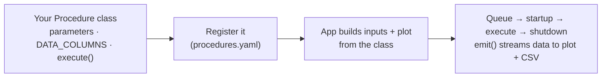

# Tutorial 6 · Write your own procedure

**Goal:** create a brand-new measurement procedure, register it, and run it from
the app — learning how the pieces fit together. **Time:** ~15 minutes.
**Hardware:** none.

So far you've *run* the procedures that ship with Laser Setup. Now you'll add
**your own**. We'll keep it simple — a procedure that records a (simulated)
signal over time — so you can focus on the moving parts. When you're ready for
the full reference (instruments, shared parameters, sequences), the
**[Developer Guide → Creating a New Procedure](../developer-guide/creating-a-procedure.md)**
goes deeper; we'll point there as we go.

!!! abstract "What you'll learn"
    - The three things every procedure needs: **parameters**, **`DATA_COLUMNS`**, and an **`execute()`** loop.
    - How a procedure becomes a clickable item in the app (**registration**).
    - How your inputs, live plot and saved file all come from the same class.

## The mental model

A **procedure** is a Python class. Laser Setup turns it into a GUI automatically:



You write the class; the framework does the rest. Let's build one.

## Step 1 — Create the procedure file

Create a new file `laser_setup/procedures/SignalVsTime.py` with this content:

```python title="laser_setup/procedures/SignalVsTime.py"
import logging
import math
import random
import time

from pymeasure.experiment import FloatParameter

from .BaseProcedure import BaseProcedure

log = logging.getLogger(__name__)
log.addHandler(logging.NullHandler())


class SignalVsTime(BaseProcedure):
    """Record a (simulated) decaying signal over time."""
    name = 'Signal vs Time'

    # 1) Parameters → become inputs in the GUI (and are saved to the file)
    duration = FloatParameter('Duration', units='s', default=10.0, minimum=0.1)
    amplitude = FloatParameter('Amplitude', units='V', default=1.0)
    noise = FloatParameter('Noise level', units='V', default=0.05, group_by='show_more')

    # 2) Which inputs to show, and in what order
    INPUTS = BaseProcedure.INPUTS + ['duration', 'amplitude', 'noise']

    # 3) The columns your measurement produces (first two = default plot axes)
    DATA_COLUMNS = ['t (s)', 'signal (V)']

    # 4) The measurement itself
    def execute(self):
        log.info("Measuring a signal for %.1f s", self.duration)
        tau = self.duration / 3 or 1.0
        t0 = time.time()
        t = 0.0
        while t < self.duration:
            if self.should_stop():                 # (1) makes the Abort button work
                log.warning("Measurement aborted by the user")
                break

            signal = self.amplitude * math.exp(-t / tau) + random.gauss(0, self.noise)
            self.emit('results', {'t (s)': t, 'signal (V)': signal})  # (2) one data row
            self.emit('progress', 100 * t / self.duration)            # (3) progress bar

            time.sleep(0.2)
            t = time.time() - t0
```

1. **Always** poll `self.should_stop()` in the loop so **Abort** (and sequences) can interrupt cleanly.
2. `emit('results', …)` sends one row to the live plot and the CSV. The dict keys **must** match `DATA_COLUMNS`.
3. `emit('progress', …)` drives the progress bar (0–100).

That's the whole procedure. We subclassed
[`BaseProcedure`](../user-guide/procedures.md), which gives us instrument
handling and the common inputs (`info`, `show_more`, …) for free. We didn't write
`startup()` or `shutdown()` because this measurement needs no setup — the base
defaults are fine.

## Step 2 — Register it

For the app to *see* your procedure, add one line under `_types` in
`laser_setup/assets/templates/procedures.yaml`:

```yaml
_types:
  # … the existing entries …
  SignalVsTime: ${class:laser_setup.procedures.SignalVsTime.SignalVsTime}
```

`${class:…}` is a [resolver](../user-guide/configuration.md#resolvers) that turns
that dotted path into the actual Python class when the config loads. The `_types`
map is exactly what fills the **Procedures** menu and the list of names the CLI
accepts.

!!! tip "Where registration belongs"
    Editing the bundled template works on a cloned repo (it's the default config).
    For a setup you maintain separately, register it in your **local**
    `config/procedures.yaml` instead — see
    [Tutorial 4](04-your-config.md) and
    [Developer Guide → Registering in YAML](../developer-guide/registering.md).

## Step 3 — Run it

Confirm the app now recognizes it:

```bash
uv run laser_setup --help      # 'SignalVsTime' should appear in the choices
```

Then open it:

```bash
uv run laser_setup SignalVsTime
```

An experiment window opens with **Duration** and **Amplitude** inputs (tick
**Show more** to reveal **Noise level**). Press **Queue** and watch the decaying
signal appear on the plot, then find your data under `data/<date>/`. 🎉

You just created and ran your own measurement.

## How the infrastructure works

What happened when you pressed **Queue**? The same pipeline every procedure uses:

| Your class member | What the framework does with it |
| --- | --- |
| `name` | The label shown in the Procedures menu and window title. |
| `Parameter` attributes + `INPUTS` | Builds the input widgets on the left (with units, limits, and `group_by` show/hide). |
| `DATA_COLUMNS` | Sets the plot axes (first two) and the CSV columns. |
| `execute()` + `emit('results', …)` | Runs in a background thread; each emitted row streams to the live plot and is written to the data file. |
| `emit('progress', …)` / `should_stop()` | Drive the progress bar and the Abort button. |
| the `_types` entry | Lets `CONFIG.procedures` find your class so `laser_setup SignalVsTime` and the menu can launch it. |

The run itself follows the **lifecycle** `startup() → execute() → shutdown()`
(see [Architecture](../user-guide/architecture.md#the-measurement-lifecycle)),
and every parameter value is saved into the file header so the measurement is
reproducible ([Data & Output Files](../user-guide/data-and-output.md)).

## Make it measure *real* hardware

`SignalVsTime` fakes its data so it runs anywhere. To measure something real you
add an **instrument** — for example, read current from a Keithley:

```python
from ..instruments import InstrumentManager, Keithley2450
from .utils import Instruments

class SignalVsTime(BaseProcedure):
    instruments = InstrumentManager()
    meter: Keithley2450 = instruments.queue(**Instruments.Keithley2450)

    def startup(self):
        self.connect_instruments()      # proxy → live (or debug) instrument
        self.meter.measure_current()

    def execute(self):
        ...
        signal = self.meter.current     # read the instrument instead of faking it
```

Run it with `uv run laser_setup -d SignalVsTime` and the Keithley is **simulated**
(debug mode) so you can develop without hardware — see
[Tutorial 5](05-real-instruments.md).

The full story — adding instruments, reusing shared parameters from
`parameters.yaml`, device (`ChipProcedure`) measurements, estimates, and
sequencer sweeps — is in the Developer Guide:

<div class="grid cards" markdown>

-   :material-flask-plus: **[Creating a New Procedure](../developer-guide/creating-a-procedure.md)**

    The complete reference, with a worked instrument example.

-   :material-tune-variant: **[Defining Parameters](../developer-guide/parameters.md)**

    Rich, reusable inputs (units, limits, choices, `group_by`).

-   :material-file-code: **[Registering in YAML](../developer-guide/registering.md)**

    Procedures, sequences and scripts.

</div>

## Recap

- A procedure = a class with **parameters**, **`DATA_COLUMNS`**, and an
  **`execute()`** loop that calls `emit('results', …)`.
- Register it with one `${class:…}` line under `_types` in `procedures.yaml`.
- Run it with `uv run laser_setup <Name>` — the GUI, plot and saved file are all
  built from your class.
- Swap the fake data for an instrument read to measure real hardware; the
  [Developer Guide](../developer-guide/creating-a-procedure.md) shows how.

That's the end of the tutorial track — you can now run, configure, sequence, and
**build** measurements. 🔬
