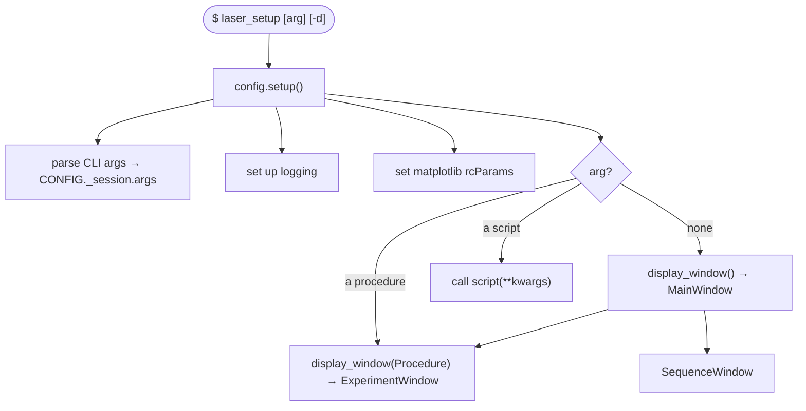
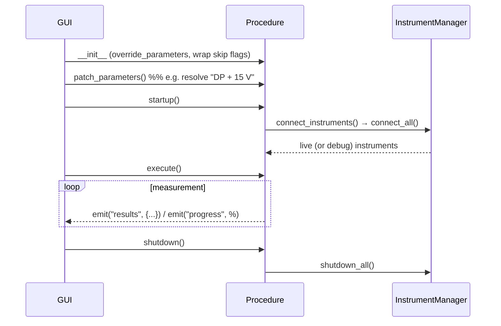

# Architecture

This page is the mental model for the whole project. Read it once and the rest
of the documentation will slot into place.

## The 30-second version

Laser Setup is a **PyMeasure application** with a **configuration layer** bolted
on top. PyMeasure provides the experiment engine (procedures, parameters,
results files, managed GUI windows). Laser Setup adds:

1. A **YAML/Hydra configuration system** so instruments, procedures and
   sequences are described in data, not code.
2. A set of **instrument drivers** and an **`InstrumentManager`** that connects
   them on demand (real or simulated).
3. A **custom GUI** (main window, experiment window, sequence window) driven by
   that configuration.

## Package layout

```text
laser_setup/
├── __main__.py          # entry point: setup() then dispatch
├── __init__.py          # applies PyMeasure patches; defines __version__
├── patches.py           # monkey-patches PyMeasure (Status enum, headers…)
├── utils.py             # data helpers (Dirac point, CSV reading, Telegram)
├── config/              # the configuration system
│   ├── config.py        #   builds the global CONFIG object
│   ├── defaults.py      #   dataclasses defining every config key + defaults
│   ├── handler.py       #   load/save/import config files
│   ├── parser.py        #   CLI args + the @configurable decorator
│   ├── log.py           #   logging setup (colored console, file)
│   └── utils.py         #   instantiate(), load_yaml(), resolvers helpers
├── procedures/          # measurement procedures
│   ├── BaseProcedure.py #   root class for all procedures
│   ├── ChipProcedure.py #   adds chip/sample params + mixins
│   ├── Sequence.py      #   sequence container
│   └── It.py, IVg.py …  #   concrete measurements
├── instruments/         # instrument drivers + manager
│   ├── manager.py       #   InstrumentManager, proxies, debug/disabled
│   ├── keithley.py, tenma.py, bentham.py, serial.py
│   └── setup.py         #   VISA auto-discovery
├── display/             # the PyQt6 GUI
│   ├── app.py           #   display_window(): splash, theming, dispatch
│   ├── Qt.py            #   qtpy abstraction + Worker thread helper
│   ├── windows/         #   main / experiment / sequence windows
│   └── widgets/         #   log, camera, text, sqlite, config, inputs
├── cli/                 # utility scripts (init, setup_adapters, …)
└── assets/
    ├── templates/*.yaml # the default config you can copy & edit
    ├── new_config.yaml  # minimal scaffold written by `init`
    └── img/splash.png
```

## Startup flow



`main()` in `__main__.py` is tiny — it calls `setup()` and then dispatches on
`args.procedure`:

```python
def main():
    setup()
    args = CONFIG._session.args
    if args.procedure is None:
        display_window()                                   # MainWindow
    elif args.procedure in CONFIG.procedures:
        display_window(instantiate(
            CONFIG.procedures._types[args.procedure], level=1))  # ExperimentWindow
    elif args.procedure in CONFIG.scripts:
        func = instantiate(CONFIG.scripts[args.procedure].target, level=1)
        func(**CONFIG.scripts[args.procedure].kwargs)        # CLI script
```

## How configuration reaches everything

`CONFIG` is a global, lazily-built `OmegaConf` object (see
[`config/config.py`](configuration.md)). Importing `laser_setup.config` triggers:

1. `ConfigHandler.load_config()` — merge **defaults → global → local**.
2. `load_and_merge(...)` four times — pull in `parameters`, `procedures`,
   `sequences`, and `instruments` from their respective files.

From then on, every subsystem reads from `CONFIG`:

- The **GUI** builds its menus from `CONFIG.procedures`, `CONFIG.sequences`,
  `CONFIG.scripts`, and reads window settings from `CONFIG.Qt`.
- **Procedures** pull parameter and instrument definitions from
  `CONFIG.parameters` / `CONFIG.instruments` (via
  `laser_setup.procedures.utils.Parameters` and `Instruments`).
- The **`@configurable` decorator** lets a class apply matching config to its
  attributes automatically when it (or a subclass) is defined.

## The measurement lifecycle

Every procedure run — whether from an experiment window or a sequence — follows
the PyMeasure lifecycle, with Laser Setup hooks layered in:



- `startup()` / `execute()` / `shutdown()` are overridable hooks. The base
  `startup`/`shutdown` are wrapped so they're skipped when `skip_startup` /
  `skip_shutdown` are set (used heavily by sequences).
- `patch_parameters()` is a pre-run hook to transform inputs (the gate-voltage
  `DP` substitution is implemented here via `VgMixin`).

## Key design ideas

- **Data over code.** Adding an instrument or tweaking a default is a YAML edit,
  not a Python change. Resolvers (`${class:...}`, `${function:...}`,
  `${sequence:...}`) turn strings into live objects.
- **Proxies + lazy connection.** Instruments are declared cheaply and connected
  only at run time, so importing a procedure never touches hardware.
- **Graceful simulation.** Debug mode (`-d`) substitutes fake instruments, so
  the entire stack runs on a laptop.
- **PyMeasure underneath.** Laser Setup deliberately reuses PyMeasure's engine
  and managed windows rather than reinventing them; `patches.py` smooths a few
  rough edges.

## Where to dig deeper

- [Configuration System](configuration.md) — the heart of the project.
- [Procedures](procedures.md) and [Creating a New Procedure](../developer-guide/creating-a-procedure.md).
- [Instruments](instruments.md) — the manager, drivers and debug mode.
- [The Graphical Interface](gui.md) — windows and widgets.
