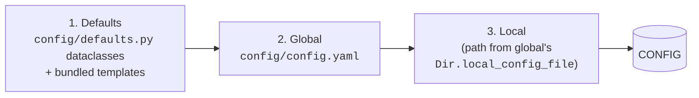

# Configuration System

Almost everything in Laser Setup is configured in YAML and merged at startup by
[OmegaConf](https://omegaconf.readthedocs.io/) with
[Hydra](https://hydra.cc/)-style instantiation. This page explains how the
layers combine, the resolver syntax, and what each configuration file controls.

!!! tip "Just want to change a value?"
    Jump to [Tutorial 4](../tutorials/04-your-config.md) for the practical
    workflow, or the [Configuration reference](../reference/configuration.md)
    for a key-by-key listing.

## The three layers

`CONFIG` is built by merging up to three sources; **later layers win**:



1. **Defaults** — the `AppConfig` dataclass in `laser_setup/config/defaults.py`
   defines every key and its default. The bundled `assets/templates/*.yaml`
   provide the default parameters/procedures/sequences/instruments.
2. **Global config** — `config/config.yaml` (created by `init`). Its path can be
   overridden with the `CONFIG` environment variable.
3. **Local config** — a machine-specific file whose path is set by the global
   config's `Dir.local_config_file`. Use it for things that differ per computer
   (COM ports, data directory).

The merge order is implemented in `ConfigHandler.load_config()`:

```python
config = OmegaConf.structured(AppConfig)          # 1. defaults
for section, key in [('Dir','global_config_file'),
                     ('Dir','local_config_file')]: # 2. then 3.
    if (path := safeget(config, section, key)) and Path(path).is_file():
        config = OmegaConf.merge(config, OmegaConf.load(path))
```

After that, `config/config.py` pulls in the four data files:

```python
load_and_merge(CONFIG.Dir.parameters_file,  CONFIG, 'parameters')
load_and_merge(CONFIG.Dir.procedures_file,  CONFIG, 'procedures')
load_and_merge(CONFIG.Dir.sequences_file,   CONFIG, 'sequences')
load_and_merge(CONFIG.Dir.instruments_file, CONFIG, 'instruments')
```

!!! danger "The blank-menu trap"
    `init` writes a `config/config.yaml` that points `procedures_file`,
    `sequences_file` and `instruments_file` at `./config/*.yaml`. Those files
    **don't exist until you copy them** from `config/templates/`. If they're
    missing, the corresponding `load_and_merge` finds nothing and the menus go
    empty. Always copy the templates you reference — see
    [Tutorial 4](../tutorials/04-your-config.md#step-2-populate-the-referenced-files).

## The configuration files

| File | `Dir` key | Controls |
| --- | --- | --- |
| `config.yaml` | `global_config_file` / `local_config_file` | Directories, GUI/window settings, filenames, logging, scripts, adapters, Telegram |
| `parameters.yaml` | `parameters_file` | Reusable parameter definitions grouped by category |
| `procedures.yaml` | `procedures_file` | Which procedures exist (`_types`) and per-procedure overrides |
| `sequences.yaml` | `sequences_file` | Sequence definitions (`_types`) |
| `instruments.yaml` | `instruments_file` | Instrument adapters, IDs and classes |

Each is documented in depth on its own page: [Procedures](procedures.md),
[Sequences](sequences.md), [Instruments](instruments.md),
[Defining Parameters](../developer-guide/parameters.md). The remainder of this
page covers `config.yaml` and the resolver mechanism shared by all of them.

## Resolvers — turning strings into objects {#resolvers}

OmegaConf *resolvers* are custom `${name:arg}` interpolations registered in
`config/config.py`. They are what let YAML reference live Python objects:

| Resolver | Expands to | Used for |
| --- | --- | --- |
| `${class:path}` | the class at `path` (`hydra.utils.get_class`) | instrument & procedure classes |
| `${function:path}` | the function at `path` (`hydra.utils.get_method`) | script targets |
| `${sequence:Name}` | a dynamically-created `Sequence` subclass | sequence `_types` |

For example, in `procedures.yaml`:

```yaml
_types:
  It: ${class:laser_setup.procedures.It}
  FakeProcedure: ${class:laser_setup.procedures.FakeProcedure.FakeProcedure}
```

and in `config.yaml`:

```yaml
scripts:
  setup_adapters:
    name: "Set up Adapters"
    target: ${function:laser_setup.cli.setup_adapters.setup}
```

### How instantiation works

These resolvers actually expand to a Hydra `_target_` mapping, e.g.
`${class:x}` → `{_target_: hydra.utils.get_class, path: x}`. The helper
`instantiate(config, level=2)` then calls `hydra.utils.instantiate` **twice** —
the first pass resolves the interpolation into the `get_class` call, the second
pass executes it to yield the class object. That's why you'll see `level=1` or
`level=2` arguments to `instantiate()` around the codebase.

## Anatomy of `config.yaml`

The template (`assets/templates/config.yaml`) is heavily commented. The main
sections:

### `Dir` — paths

```yaml
Dir:
  local_config_file: ./config/config.yaml
  parameters_file:   ./config/parameters.yaml
  procedures_file:   ./config/procedures.yaml
  sequences_file:    ./config/sequences.yaml
  instruments_file:  ./config/instruments.yaml
  data_dir:          ./data          # where CSVs are written
  database:          database.db      # SQLite name, relative to data_dir
```

### `scripts` — the Scripts menu

Each entry is a `MenuItemConfig` (`name`, `target`, optional `kwargs`). The
default scripts are `init`, `setup_adapters`, `get_updates`,
`parameters_to_db` and `find_calibration_voltage`. Add your own by pointing
`target` at any importable function:

```yaml
scripts:
  my_tool:
    name: "My Tool"
    target: ${function:my_package.my_module.main}
    kwargs: {verbose: true}
```

### `Adapters` — convenience addresses

A flat list of named adapter addresses (USB/COM). `instruments.yaml` is the
authoritative place for instrument wiring, but this section is handy for shared
references.

### `Qt` — the interface

Controls every window. Highlights:

```yaml
Qt:
  GUI:
    style: Fusion          # Qt style; 'default' uses the OS default
    dark_mode: true
    font_size: 12
  ExperimentWindow:
    dock_plot_number: 2    # plots shown in the Dock tab
    info_file: ./docs/led_protocol.md   # Markdown shown in the Info tab
  MainWindow:
    readme_file: ./README.md
    title: Laser Setup
    size: [640, 480]
  SequenceWindow:
    abort_timeout: 30      # seconds before the abort dialog auto-dismisses
```

### `Filename` — how data files are named

```yaml
Filename:
  prefix: ''          # empty → use the procedure class name
  suffix: ''
  ext: csv
  dated_folder: true  # data/YYYY-MM-DD/
  index: true         # append _1, _2, …
  datetimeformat: "%Y-%m-%d"
```

See [Data & Output Files](data-and-output.md).

### `Logging` — standard `logging.config.dictConfig`

A console handler (colored, INFO) and a file handler
(`log/laser_setup.log`, DEBUG). Change levels here to make the app more or less
verbose.

### `matplotlib_rcParams` and `Telegram`

`matplotlib_rcParams` is passed to PyMeasure to style plots (values must be
strings). `Telegram` holds an optional bot `token` and `chat_ids`; when set,
`ChipProcedure` sends a "measurement finished" alert (see
[`utils.send_telegram_alert`](../developer-guide/internals.md)).

## Editing config from the app

The **Config** menu opens a live editor (`ConfigWidget`) that renders `CONFIG`
as an editable tree, saves it back to YAML, and offers **Import** to switch to a
different local config file. After saving, click **Reload** (++ctrl+r++) so the
app rebuilds `CONFIG`.

## The `@configurable` decorator

Classes can opt into automatic configuration. `BaseProcedure` is decorated with
`@configurable('procedures', on_definition=False)`, which means: whenever a
subclass is defined, the framework looks up `procedures.<ClassName>` in `CONFIG`
and applies it (parameter overrides, attribute values) via
`configure_class()`. This is how a `procedures.yaml` block like:

```yaml
It:
  parameters:
    procedure_version: {value: 2.2.0}
    vg: {value: "DP + 0. V"}
```

ends up modifying the `It` class without any code. Details in
[Internals](../developer-guide/internals.md).

## Further reading

- [Configuration reference](../reference/configuration.md) — every key.
- [Defining Parameters](../developer-guide/parameters.md) — the parameter YAML
  schema.
- [Registering in YAML](../developer-guide/registering.md) — adding procedures
  and sequences.
