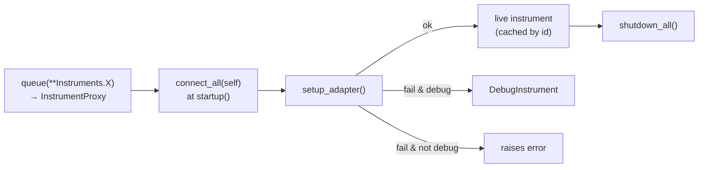

# Instruments

Laser Setup talks to lab hardware through PyMeasure instrument classes,
coordinated by an **`InstrumentManager`**. Instruments are declared as data in
`instruments.yaml`, queued cheaply on procedure classes, and connected only when
a measurement starts — as real devices or simulated ones.

## Supported instruments

| Class | Hardware | Connection | Driver module |
| --- | --- | --- | --- |
| `Keithley2450` | Keithley 2450 SourceMeter | VISA (USB/GPIB) | `instruments/keithley.py` |
| `Keithley6517B` | Keithley 6517B Electrometer | VISA | re-exported from PyMeasure |
| `TENMA` | TENMA 72-xxxx power supplies | Serial (COM) | `instruments/tenma.py` |
| `ThorlabsPM100USB` | Thorlabs PM100D/USB power meter | VISA | PyMeasure |
| `Bentham` | Bentham TLS120Xe tunable light source | Proprietary USB (`bendev`) | `instruments/bentham.py` |
| `PT100SerialSensor` | RosaTech PT100 temperature sensor | Serial | `instruments/serial.py` |
| `Clicker` | RosaTech hot-plate controller | Serial | `instruments/serial.py` |

Any instrument from the
[PyMeasure library](https://pymeasure.readthedocs.io/en/latest/api/instruments/index.html)
can be used too — just point a YAML `target` at its class.

## Declaring instruments (`instruments.yaml`)

Each entry maps a logical name to an adapter address, an identity string, and
the class to instantiate:

```yaml
Keithley2450:
  adapter: USB0::0x05E6::0x2450::04448997::0::INSTR
  name: Keithley 2450
  IDN: KEITHLEY
  target: ${class:laser_setup.instruments.keithley.Keithley2450}

TENMANEG:
  adapter: COM3
  IDN: TENMA 72-2715 V6.6 SN:37793902
  target: ${class:laser_setup.instruments.tenma.TENMA}

Bentham:
  adapter: COM6
  target: ${class:laser_setup.instruments.bentham.Bentham}
  kwargs:
    read_termination: \r\n\x00
    write_termination: \r\n\x00
```

| Field | Purpose |
| --- | --- |
| `adapter` | The address: a VISA resource string, a COM port, or a serial number. |
| `name` | Friendly label. |
| `IDN` | Identity substring used by `setup_adapters` to recognize the device. |
| `target` | `${class:...}` resolver pointing to the instrument class. |
| `kwargs` | Extra constructor arguments (termination chars, vendor IDs, `debug`, …). |

The `Instruments` object in `laser_setup/procedures/utils.py` instantiates this
config so procedures can reference `Instruments.Keithley2450`, etc.

## The InstrumentManager lifecycle



1. **Queue (class definition).** A procedure declares
   `meter: Keithley2450 = instruments.queue(**Instruments.Keithley2450)`. This
   stores config in an `InstrumentProxy` — no hardware contacted, so importing a
   procedure is cheap and side-effect-free.
2. **Connect (startup).** `connect_instruments()` → `instruments.connect_all(self)`
   scans the instance for proxies and replaces each with a real instrument via
   `setup_adapter()`. Instances are **cached** by `f"{Class}/{adapter}"`, so two
   procedures sharing the same physical device reuse one connection.
3. **Use (execute).** Your `execute()` drives the instruments
   (`self.meter.get_data()`, `self.tenma_pos.ramp_to_voltage(...)`, …).
4. **Shutdown.** `shutdown_all()` calls each instrument's `shutdown()` (Keithley
   plays a beep, TENMA ramps to 0 V, Bentham turns off the lamp) and clears the
   cache.

## Debug mode {#debug-mode}

Running with `-d` sets `debug=True` on every instrument config
(`procedures/utils.py`). Then, in `setup_adapter()`:

```python
try:
    return instrument_class(adapter=adapter, **kwargs)
except Exception as e:
    if debug:
        return DebugInstrument(**kwargs)   # random data, no I/O
    raise e
```

So with `-d`, any instrument that can't connect is replaced by a
`DebugInstrument` that returns random values for voltage/current/power/
temperature. Without `-d`, a failed connection **raises** — by design, so you
never confuse simulated data with a real measurement.

!!! note "Shutdown is skipped for fakes"
    `shutdown_all()` skips instruments backed by a `FakeAdapter`, so debug runs
    don't try to power down nonexistent hardware.

## Disabling instruments per run {#disabling}

Procedures frequently override `connect_instruments()` to skip instruments based
on toggles:

```python
def connect_instruments(self):
    if not self.laser_toggle:
        self.instruments.disable(self, 'tenma_laser')
    if not self.sense_T:
        self.instruments.disable(self, 'temperature_sensor')
    super().connect_instruments()
```

`disable()` swaps the instrument for a **`DisabledInstrument`** — a no-op object
that silently accepts any command and returns falsy values. This lets the same
procedure run with or without the laser/temperature hardware without branching
all through `execute()`.

!!! warning "Silent by design"
    Because a disabled instrument swallows everything, a *typo'd* attribute on a
    real instrument won't raise either if it was disabled. Keep `execute()`
    logic clear about what's optional.

## Auto-discovering adapters

Adapter addresses change per machine. The **`setup_adapters`** script
(`instruments/setup.py`) scans the VISA bus, queries `*IDN?` on each resource,
matches it against the `IDN` strings in `instruments.yaml`, and writes the
discovered addresses back to the file:

```bash
uv run laser_setup setup_adapters
```

TENMA supplies share one IDN, so it briefly energizes each and asks which one
you saw respond, mapping `tenma_neg` / `tenma_pos` / `tenma_laser` correctly.

!!! info "Needs a VISA backend"
    Discovery requires NI-VISA or `pyvisa-py`. With neither installed,
    `list_resources()` is empty and nothing is found — see
    [Installation → VISA backend](../getting-started/installation.md#visa-backend).

## Instrument-specific notes

- **Keithley 2450** — named trace buffers (`make_buffer`, `clear_buffer`,
  `get_data`), voltage-source / current-measure with NPLC and current range.
- **TENMA** — software voltage *ramping* (`ramp_to_voltage`) to avoid overshoot;
  `shutdown()` ramps to 0 V before disabling the output.
- **Bentham** — wraps the proprietary `bendev` USB driver (not on PyPI); sets
  remote mode and controls monochromator wavelength, filter wheel and xenon lamp.
- **PT100SerialSensor** — runs a background daemon thread that continuously
  polls temperature; read `self.temperature_sensor.data` for the latest tuple.
- **Clicker** — hot-plate controller using a "set target, then `go()`" pattern.

To add a brand-new instrument, see
[Adding an Instrument](../developer-guide/adding-an-instrument.md).
