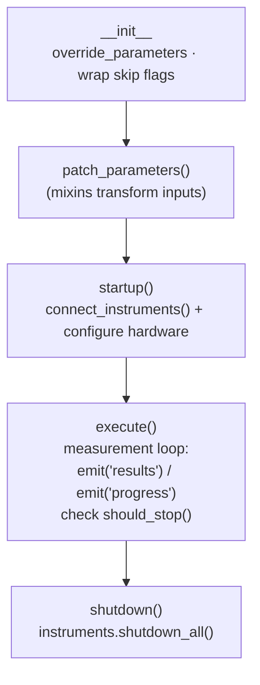

# Procedures

A **procedure** is a single measurement: it declares parameters and data
columns, connects instruments, and runs a `startup → execute → shutdown`
lifecycle, emitting results as it goes. Procedures are ordinary PyMeasure
`Procedure` subclasses with a Laser Setup base class added on top.

This page explains the class hierarchy and catalogs the built-in procedures. To
*write your own*, see [Creating a New Procedure](../developer-guide/creating-a-procedure.md).

## The class hierarchy

```mermaid
classDiagram
    Procedure <|-- BaseProcedure
    BaseProcedure <|-- ChipProcedure
    BaseProcedure <|-- FakeProcedure
    BaseProcedure <|-- Wait
    ChipProcedure <|-- IVg
    ChipProcedure <|-- It
    ChipProcedure <|-- IV
    ChipProcedure <|-- Others["… all device measurements"]
    class Procedure {
      +startup() execute() shutdown()
      +emit(topic, value)
      +should_stop()
    }
    class BaseProcedure {
      +instruments: InstrumentManager
      +procedure_version, show_more, info
      +skip_startup / skip_shutdown
      +connect_instruments()
      +patch_parameters()
    }
    class ChipProcedure {
      +chip_group, chip_number, sample
      +Telegram alert on finish
    }
```

### `Procedure` (PyMeasure)

Provides the engine: the lifecycle hooks, `emit()` for streaming results/progress,
`should_stop()` for cooperative aborts, and the `Parameter`/`Metadata`/
`DATA_COLUMNS` machinery. Read the
[PyMeasure docs](https://pymeasure.readthedocs.io/en/latest/) for the full API.

### `BaseProcedure`

The root of *all* Laser Setup procedures (`procedures/BaseProcedure.py`). It:

- adds common parameters: `procedure_version`, `show_more`, `info`,
  `skip_startup`, `skip_shutdown`, and a `start_time` metadata;
- owns an `instruments = InstrumentManager()`;
- implements `connect_instruments()`, default `startup()` (connect) and
  `shutdown()` (shut down all instruments);
- wraps `startup`/`shutdown` so they're skipped when `skip_startup`/
  `skip_shutdown` are true (vital for sequences);
- is `@configurable('procedures')`, so YAML overrides apply automatically.

Key class attributes you'll set in subclasses:

| Attribute | Meaning |
| --- | --- |
| `name` | Human-readable name shown in the GUI. |
| `INPUTS` | List of parameter names to show as inputs (order matters). |
| `DATA_COLUMNS` | Column names; the first two are the default plot axes. |
| `EXCLUDE` | Parameters to leave out of the saved file header. |
| `SEQUENCER_INPUTS` | Parameters a sequence may sweep. |

### `ChipProcedure`

Base for all **device** measurements (`procedures/ChipProcedure.py`). Adds
`chip_group`, `chip_number` and `sample` inputs (so every file records which
device was measured) and sends a **Telegram alert** when a run finishes. It also
defines two mixins used across procedures:

- **`LaserMixin`** — zeroes the laser voltage when `laser_toggle` is off.
- **`VgMixin`** — evaluates the dynamic gate-voltage expression (`DP + 15 V`),
  substituting the sample's latest Dirac point.

Both hook into `patch_parameters()`, which runs just before a measurement.

## Built-in procedure catalog

| Procedure | `name` | Measures | Notable instruments |
| --- | --- | --- | --- |
| `IVg` | I vs Vg | Current vs. gate voltage (transfer curve); estimates the Dirac point | Keithley, TENMA ×2 |
| `IV` | I vs V | Current vs. drain–source voltage sweep | Keithley, TENMA |
| `VVg` | V vs Vg | Voltage vs. gate voltage (constant current) | Keithley, Bentham |
| `It` | I vs t | Current vs. time, 3-phase laser off/on/off | Keithley, TENMA ×3, PT100, Clicker |
| `Vt` | V vs t | Voltage vs. time (constant current), 3-phase laser | Keithley, TENMA, PT100 |
| `ItVg` | I vs t @ Vg steps | Time-resolved current at several gate voltages | Keithley, TENMA |
| `ItWl` | I vs t @ wavelengths | Time-resolved current vs. light wavelength | Keithley, Bentham |
| `Tt` | T vs t | Plate-temperature sweep over time | Clicker, PT100 |
| `Pt` | P vs t | Optical power vs. time, 3-phase laser | Thorlabs PM100 |
| `Pwl` | P vs wavelength | Optical power vs. wavelength | Bentham, Thorlabs |
| `LaserCalibration` | Laser calibration | Optical power vs. laser-driver voltage | TENMA, Thorlabs |
| `Stress` | Stress & relax | High bias/temperature, then monitored relaxation | Keithley, TENMA, Clicker |
| `Wait` | Wait | Does nothing for a set time (sequence spacer) | none |
| `FakeProcedure` | Fake Procedure | Synthetic data for demos/tests | none |

!!! info "Backward-compatible aliases"
    `procedures/__init__.py` defines `IVT`, `ITt`, `IVgT` as aliases of `IV`,
    `It`, `IVg` for older configs/scripts.

A parameter-level breakdown of each procedure is in the
[Procedure catalog reference](../reference/procedures.md).

## The lifecycle in detail



- **`startup()`** configures hardware (reset meter, set ranges, enable sources).
- **`execute()`** is the measurement loop. It must check `self.should_stop()`
  regularly so **Abort** works, and call `self.emit('results', dict(...))` with
  keys matching `DATA_COLUMNS`.
- **`shutdown()`** safely powers things down. With `BaseProcedure`, the default
  shuts down every connected instrument.

Worked examples (FakeProcedure and It) are in
[Creating a New Procedure](../developer-guide/creating-a-procedure.md).

## Parameters come from config

Most procedures don't hard-code parameter definitions — they pull them from the
shared `parameters.yaml` via `laser_setup.procedures.utils.Parameters`:

```python
from .utils import Parameters
class It(...):
    vds = Parameters.Control.vds          # a FloatParameter defined in YAML
    laser_v = Parameters.Laser.laser_v
```

This keeps units, limits and descriptions consistent across procedures. See
[Defining Parameters](../developer-guide/parameters.md).
